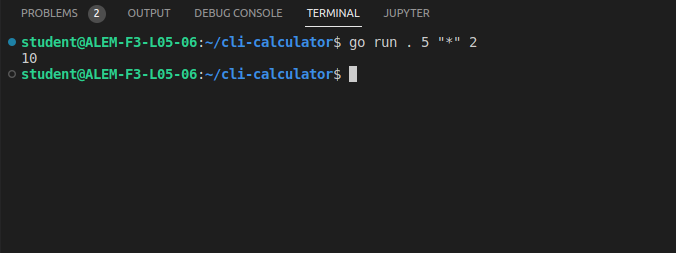

# Description:
This is test project for KATA academy

command line calculator with roman numbers

```
                    _____________________
                    |  _________________  |
                    | |              /  | |
                    | |       /\    /   | |
                    | |  /\  /  \  /    | |
                    | | /  \/    \/     | |
                    | |/             JO | |
                    | |_________________| |
                    |  __ __ __ __ __ __  |
                    | |__|__|__|__|__|__| |
                    | |__|__|__|__|__|__| |
                    | |__|__|__|__|__|__| |
                    | |__|__|__|__|__|__| |
                    | |__|__|__|__|__|__| |
                    | |__|__|__|__|__|__| |
                    |  ___ ___ ___   ___  |
                    | | 7 | 8 | 9 | | + | |
                    | |___|___|___| |___| |
                    | | 4 | 5 | 6 | | - | |
                    | |___|___|___| |___| |
                    | | 1 | 2 | 3 | | x | |
                    | |___|___|___| |___| |
                    | | . | 0 | = | | / | |
                    | |___|___|___| |___| |

```
# Authors

- [@with-insomnia](https://github.com/with-insomnia)


# Usage:
 1. Download this [repository](https://github.com/with-insomnia/cli-calculator).
 ```
 git clone git@github.com:with-insomnia/cli-calculator.git
 ```


 2. 
 ```
cd cli-calculator
```

3. Adding a guesser is simple. You just need to add in the URL a guesser, in other words, the name of one of the files present in the 

```console
go run . 5 "*" 2
```

4. Example

